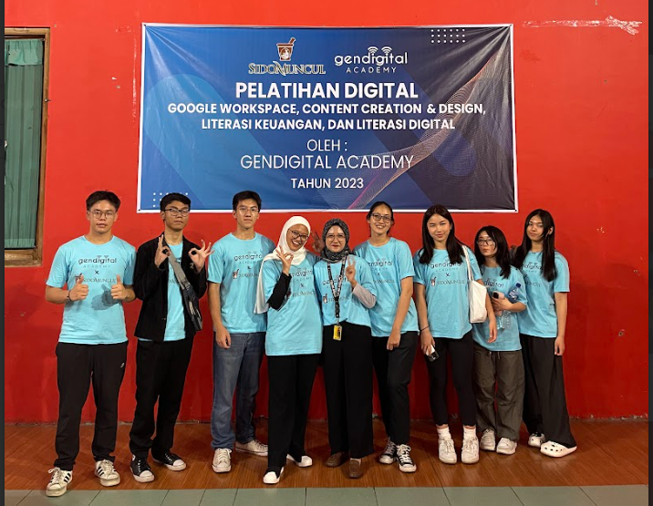
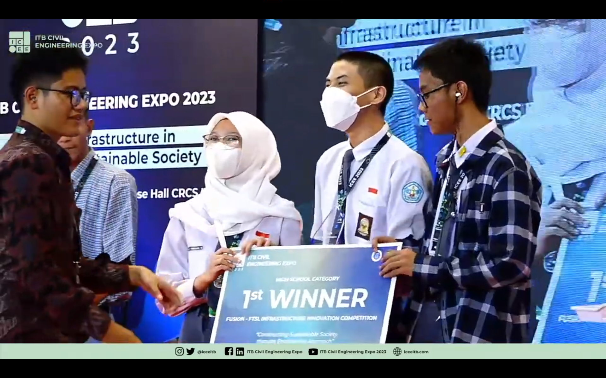
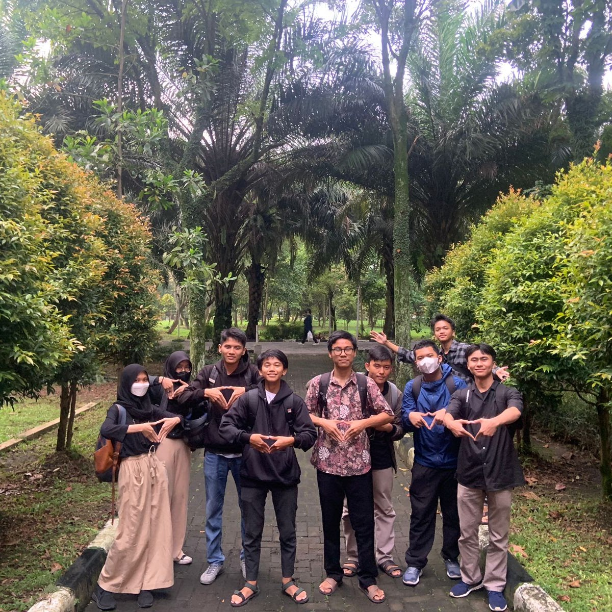

+++
title = 'About Me'
+++

## Personal Information
**Full Name:** Dimastio Setiawan   
**Current Address:** Bandung, Indonesia  
**Background:** Programming, design, animation

## Summary
Hello, I'm Dimas, the author. Welcome to my blogging website where I'll post a lot of stuff about technology. I'm currently applying for college majoring in Computer Science/Engineering. I'm motivated to learn and grow with higher education as well as to create innovations for the benefit of society.

## Education
- **Universitas Pendidikan Indonesia**  
Bachelor of Computer Engineering  
September 2024 - Present

## Organization & Volunteering
- **GenDigital Academy**
    - **Curriculum Developer** ; June 2023 - June 2024  
    Contributing in the development of materials for digital education through online and on-site learning.
    - **Teacher** ; September 2023 - October 2023
    Joined a team of teachers in several events held in Semarang. Partnered with Sidomuncul to bring local businesses online.
- **Informatika 24**
    - **President** ; January 2023 - January 2024  
    Led the organization and created several programs related to the development of ICT in school.
    - **Curriculum Developer** ; July 2022 - December 2022
    Developed a curriculum in cybersecurity and later contributed in the development of e-voting website run by the school.

## Awards
- [ICEE ITB FTSL Innovation Summit 2023 - Grand Champion](https://www.instagram.com/p/CrQIKYpJ99U/?utm_source=ig_web_copy_link&igsh=MzRlODBiNWFlZA==)
- [Sampoerna University FUTURISME Engineering Competition - 3rd Place](https://www.instagram.com/p/CznYvGaLLMD/?utm_source=ig_web_copy_link&igsh=MzRlODBiNWFlZA==)
- [KomodoHacks 1.0 - 3rd Place Sustainable Development Track](https://devpost.com/software/deezent-name-tbd)
- [CADTable CADAthon - Advanced Category Winner](https://devpost.com/software/mandalika-apartment-complex)
- [YPSTEM Hackathon 2022 - 13th Place Overall](https://devpost.com/software/pentron)
- [Ink and Metal STEM Olympics - 3D Modelling First Place](https://devpost.com/software/e-xchange)

## Projects & Activities
- **Sidomuncul x GenDigital Academy: Goes to Semarang!**

- **ICEE ITB FTSL Innovation Summit 2023**

- **Informatika 24 Goes to Telkom University**
